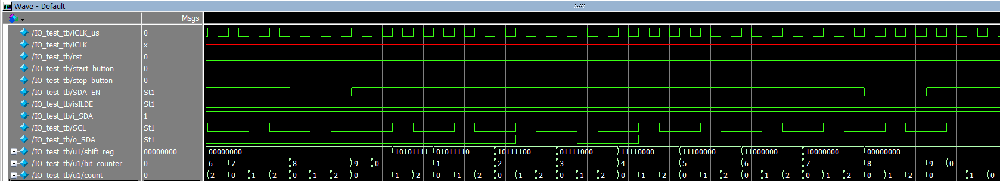
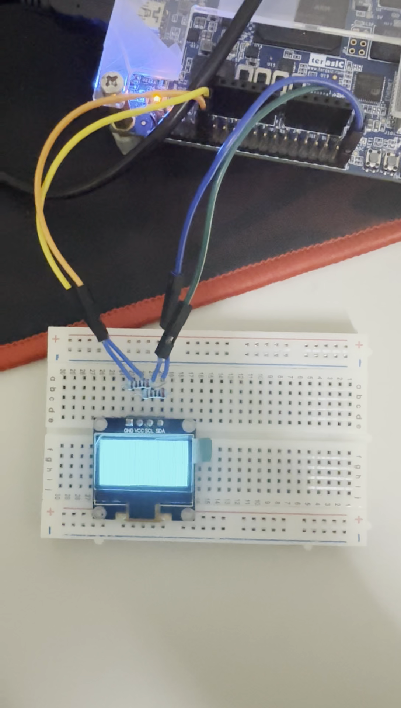
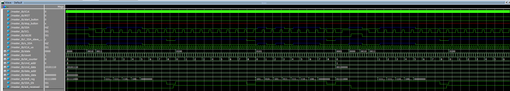
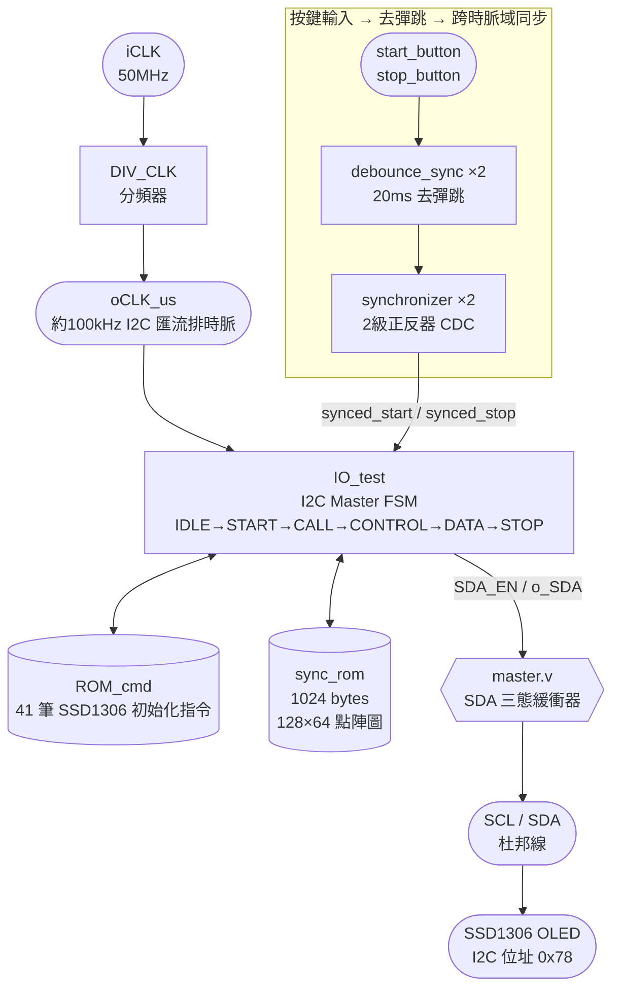
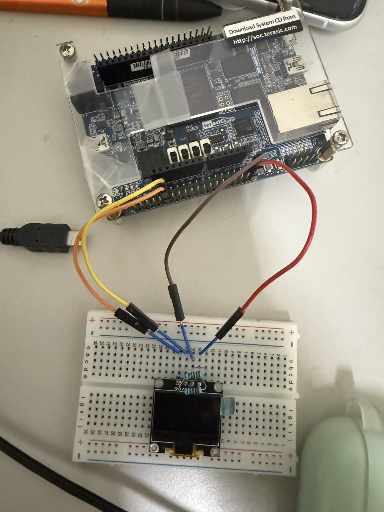
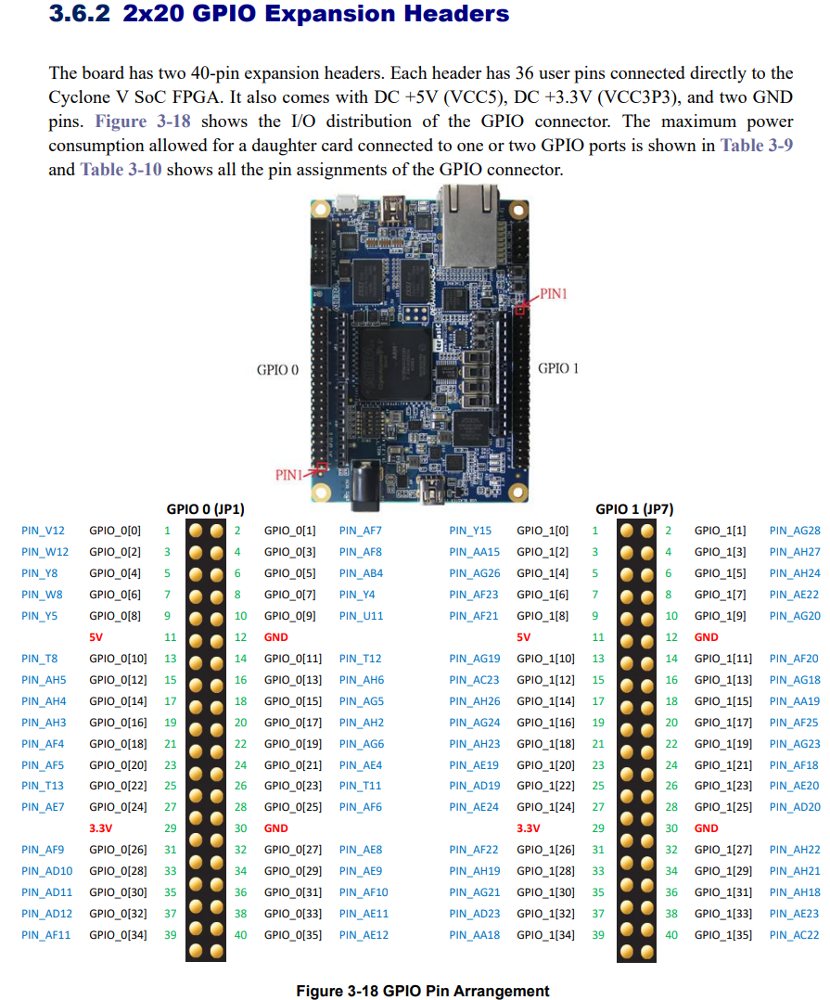

# FPGA I2C Master — SSD1306 OLED Driver

-blue)


-brightgreen)


## 📌 專案簡介 (Overview)

本專案完成於 **2025 年、大二**期間，從零手刻一個 **I2C Master 控制器**，不使用任何 IP 或現成
I2C 控制器 IP core，純用 Verilog 狀態機實作 START/STOP 條件、位元傳輸與 ACK 偵測，透過杜邦線
接到 **SSD1306 0.96" OLED**（I2C 位址 `0x78`），送出完整的初始化指令序列，再把一張 128×64 的
點陣圖畫面傳輸上去顯示。

系統分成兩個時脈域：FPGA 端 50 MHz 高速時脈負責按鍵去彈跳，再分頻出約 100 kHz（I2C
Standard-mode 速度）的匯流排時脈驅動整個 I2C 狀態機，兩個時脈域之間用雙正反器同步器
（synchronizer）安全地跨時脈域傳遞按鍵訊號。

---

## 🏆 專案亮點

- 🔌 **純手刻 I2C Master**：不掛 IP，自己刻 START/STOP 條件、逐位元 shift、ACK 偵測與錯誤處理
- ⏱️ **雙時脈域設計**：50 MHz 去彈跳 + 分頻出 ~100 kHz I2C 時脈，中間用同步器安全跨時脈域
- 🧪 **模擬驗證優先**：`master_tb.v` 自己寫了一個假 I2C Slave，會在正確時機自動回 ACK，完整
  跑過「按鍵 → 送指令 → 送圖像資料」整個流程才上板測試
- 🔍 **模擬波形 + SignalTap 交叉比對時序**：用 ModelSim 模擬波形與內嵌 SignalTap 邏輯分析儀
  量測 START/STOP 條件的實際持續時間，抓出時序不符 I2C 規範的問題
- 🐛 **完整除錯歷程**：從 6 月到 9 月，橫跨三個月的每週進度報告都留著，記錄了從「不知道有沒有
  收到 ACK」到「畫面出得來但不是預期畫面」的完整排查過程（詳見下方）

---

## 🐛 除錯歷程 (Debugging Journey)

這個專案前後花了將近三個月才成功點亮螢幕，從每一次進度報告的簡報內容整理成下面的時間軸——
是真實的除錯紀錄，不是事後美化過的版本。

### 6/25 進度報告 — 第一個 byte 收不到

一開始傳送資料時，第一個 byte 完全收不到。用模擬波形逐拍比對後發現，是 `shift_reg` 更新和
`o_SDA` 輸出**搶在同一拍動作**，導致輸出還沒穩定就被覆蓋。解法是把 `count` 多算一拍，讓兩者
錯開。同時也還不確定 ACK 有沒有正確收到，於是把邏輯訂死為「`ack_received` 為 1 才繼續下一步，
為 0 就直接跳回 `STOP`」，並逐筆核對 41 筆初始化指令的內容（例如第 10 筆 `6'd10 : data = 8'hA1`）
是否正確。



### 7/8 – 7/23 進度報告 — 懷疑按鍵彈跳與 ACK 時序

接下來卡在不確定問題出在哪：是按鍵彈跳（debounce）造成誤判 start，還是 ACK 的時序沒抓好導致
讀不到？針對這兩個懷疑方向寫出具體問題去請教學長。

### 7/8 – 8/18 進度報告 — 畫面出得來，但不是預期的畫面（卡了快一個月）

這是整個專案最久的一個坑：螢幕**畫面能出來了，但不是預期的圖案**，整片被點亮成一片空白／青色，
完全看不出原本要顯示的 128×64 點陣圖。一度以為是初始化指令不適合這塊板子、或是訊號根本沒送出去，
找了快一個月都沒有頭緒。



> 這張就是上面提到「全亮」的實際照片，直接從進度報告的簡報裡截出來的。對應的完整影片：
> [docs/media/IMG_1903.MOV](docs/media/IMG_1903.MOV)

### 8/18 – 9/3 進度報告 — 找到根因：START/STOP 條件時序不合規

最後在學長協助下，重新去對照 I2C 規範檢查自己的時序，用模擬波形與內嵌 SignalTap 邏輯分析儀
量到 **START 位元與 STOP 位元的實際持續時間約 1560 ns**，抓出時序不符合 I2C 規範的問題。修正後，
FSM 狀態機終於能穩定跑完整個 `CALL → CONTROL → DATA → IDLE` 的循環，畫面也順利正確顯示。



> 修正後的成功畫面影片：[docs/media/IMG_1982.MOV](docs/media/IMG_1982.MOV)

### 心得

> 第一次接觸 I2C 非常陌生，剛開始只知道基本原理，不曉得該如何運作實現。中途經歷很多次挫折，
> 從六月初到八月底，常常找不到錯誤的地方。第一個問題是不確定有沒有收到 ACK，一度誤認為是板子、
> 接線、腳位等各種硬體問題。第二個大問題找了一個月，畫面能出來但不是預期的，一度以為是指令不
> 適合這塊板子。最後在學長的幫助下去檢查時序是否符合 I2C 規範，才在最後一次嘗試中找出問題，
> 順利跑出畫面。

---

## ⚙️ 規格摘要 (Key Specifications)

| 項目 | 內容 |
| :--- | :--- |
| **開發板 (Board)** | Cyclone V FPGA 開發板，`5CSEMA4U23C6` |
| **顯示器** | SSD1306 0.96" OLED（128×64，單色，I2C 位址 `0x78`） |
| **語言 / 工具鏈** | Verilog HDL / Intel Quartus Prime |
| **連接方式** | 杜邦線：SCL → GPIO_1[0]、SDA → GPIO_1[1] |
| **時脈系統** | 50 MHz 輸入 → `DIV_CLK` 分頻 → 約 100 kHz（I2C Standard-mode）匯流排時脈 |
| **I2C 狀態機** | IDLE → START → CALL（位址）→ CONTROL（控制位元組）→ DATA → STOP |
| **初始化指令** | 41 筆 SSD1306 設定指令（`ROM_cmd.v`），涵蓋定址模式、掃描方向、對比度、充電幫浦等 |
| **顯示內容** | 128×64 點陣圖（`sync_rom.v`，1024 bytes） |
| **除錯方式** | ModelSim 模擬波形 + 內嵌 SignalTap 邏輯分析儀，交叉比對 START/STOP 條件時序 |

---

## 🏛️ 系統架構 (System Architecture)



### 模組說明 (Module Breakdown)

| 檔案 | 說明 |
| :--- | :--- |
| [`master.v`](rtl/master.v) | 頂層模組：整合去彈跳、分頻、同步器與 I2C 引擎，並實作 SDA 三態緩衝器 |
| [`IO_test.v`](rtl/IO_test.v) | I2C 核心狀態機：START/STOP 條件產生、逐位元傳輸、ACK 偵測，依序送出初始化指令與圖像資料 |
| [`DIV_CLK.v`](rtl/DIV_CLK.v) | 時脈分頻器：50 MHz → 約 100 kHz，供 I2C 狀態機使用 |
| [`synchronizer.v`](rtl/synchronizer.v) | 通用 2 級正反器同步器，處理跨時脈域訊號 |
| [`debounce_sync.v`](rtl/debounce_sync.v) | 按鍵去彈跳（20ms），含同步器降低亞穩態 |
| [`ROM_cmd.v`](rtl/ROM_cmd.v) | SSD1306 初始化指令 ROM（41 筆，逐筆註解說明每個指令的作用） |
| [`sync_rom.v`](rtl/sync_rom.v) | 128×64 點陣圖畫面資料 ROM（1024 bytes） |

### 測試平台 (Testbenches)

| 檔案 | 說明 |
| :--- | :--- |
| [`master_tb.v`](rtl/master_tb.v) | 系統級模擬：自己寫了一個會依時機自動回 ACK 的假 I2C Slave，完整跑過「按鍵觸發 → 送指令 → 送圖像」流程 |
| [`IO_test_tb.v`](rtl/IO_test_tb.v) | 針對 I2C 核心狀態機的單元測試 |
| [`synchronizer_tb.v`](rtl/synchronizer_tb.v) | 同步器單元測試 |
| [`debounce_sync_tb.v`](rtl/debounce_sync_tb.v) | 去彈跳模組單元測試 |

---

## 🔌 接線方式 (Wiring)



| 訊號 | FPGA 腳位 | 接往 SSD1306 |
| :--- | :--- | :--- |
| SCL | `PIN_Y15`（GPIO_1[0]）| SCL |
| SDA | `PIN_AG28`（GPIO_1[1]）| SDA |
| — | — | VCC（3.3V）、GND |

腳位對照表出自開發板官方使用手冊的 GPIO 接頭章節：



> 這份手冊截圖顯示的是雙 40-pin GPIO 排針 + 乙太網路孔 + Micro-USB 的小板子配置，
> 對照晶片型號 `5CSEMA4U23C6`，應該是 Terasic 的 Cyclone V SoC 系列開發板
> （例如 DE0-Nano-SoC / Atlas-SoC 這類）——實際板名麻煩你確認一下，我再幫你把 README 補精確。

---

## 📹 實機照片與影片

- [docs/media/IMG_1356.HEIC](docs/media/IMG_1356.HEIC)（板子與 OLED 接線實拍照，iPhone HEIC 格式，多數瀏覽器無法直接預覽）
- [docs/media/IMG_1903.MOV](docs/media/IMG_1903.MOV) — 除錯階段「整片全亮」的問題紀錄（對應上方 8/18 進度報告）
- [docs/media/IMG_1982.MOV](docs/media/IMG_1982.MOV) — 修正時序問題後，最終成功顯示畫面的版本

---

## 🔧 如何開啟專案 (How to Open in Quartus)

1. 安裝 [Intel Quartus Prime](https://www.intel.com/content/www/us/en/software-kit/programmable/quartus-prime/prime-lite.html)（Lite 版即可，需支援 Cyclone V）
2. `File` → `Open Project` → 選擇 `rtl/lab4.qpf`
3. `Processing` → `Start Compilation` 進行合成與燒錄檔產生
4. 透過 USB-Blaster 燒錄至開發板，並依規格表的腳位接上 SSD1306（SCL/SDA/GND/VCC）

---

## 📂 專案結構 (Repository Structure)

```
FPGA-I2C-SSD1306-OLED/
├── rtl/                       # 手刻 Verilog 原始碼 + 測試平台 + Quartus 專案檔
│   ├── master.v               (頂層)
│   ├── IO_test.v               (I2C 核心狀態機)
│   ├── DIV_CLK.v
│   ├── synchronizer.v
│   ├── debounce_sync.v
│   ├── ROM_cmd.v
│   ├── sync_rom.v
│   ├── master_tb.v / IO_test_tb.v / synchronizer_tb.v / debounce_sync_tb.v
│   └── lab4.qpf / lab4.qsf
├── docs/
│   └── media/                 # 實機照片與 Demo 影片
└── README.md
```

---

## 👤 作者 (Author)

**CHEN SHUO HU**（大二，2025）

RTL、I2C 狀態機設計與除錯皆為個人獨立完成。
